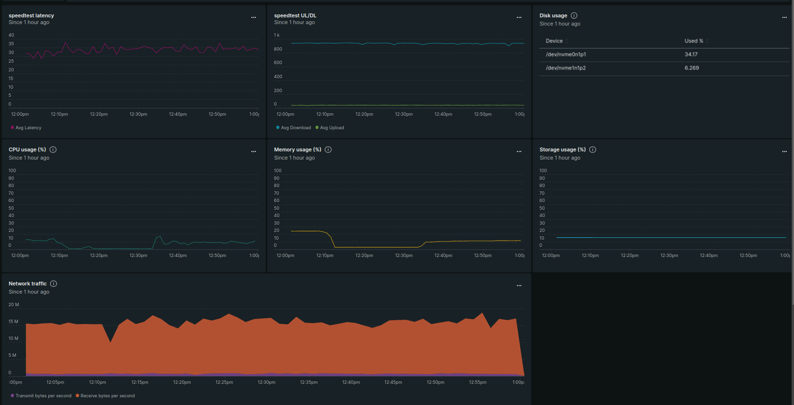
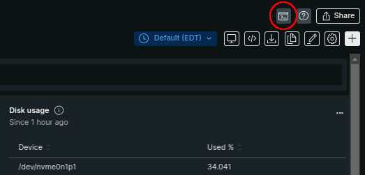
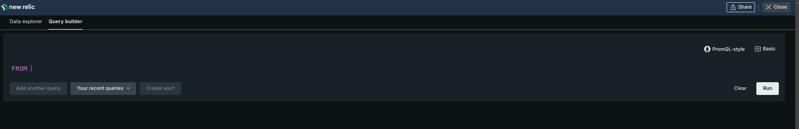
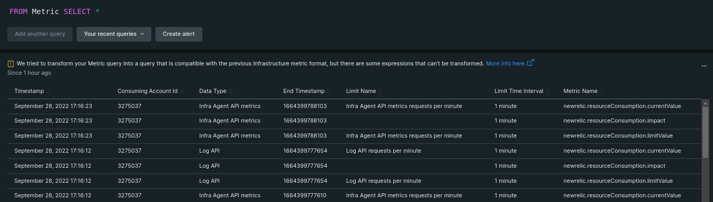
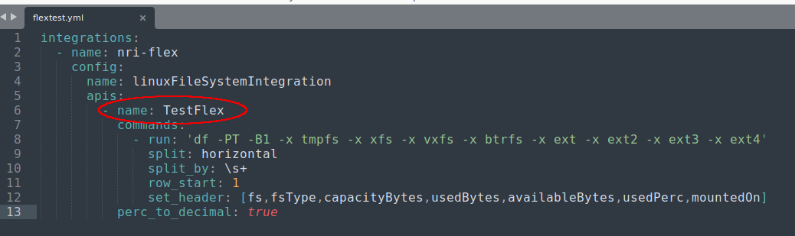
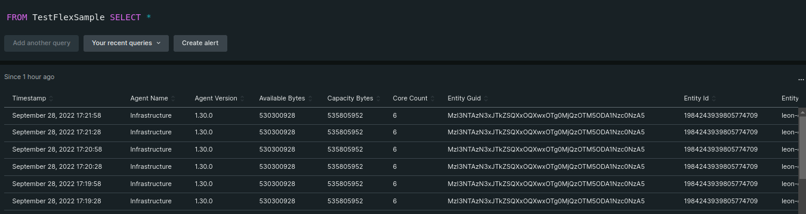
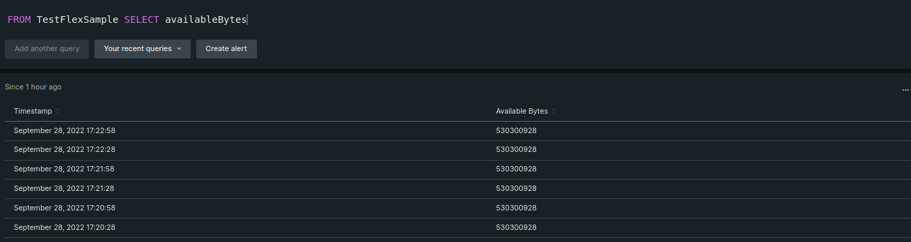
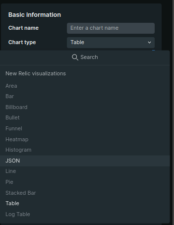
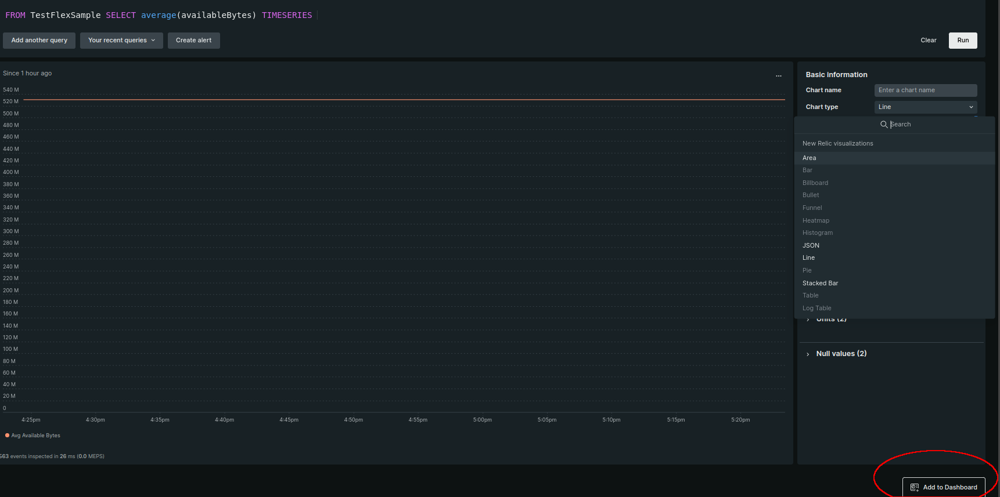

When you're just getting started with New Relic, most of what you need is available right out of the gate. Between the [pre-built agents and quick starts](https://developer.newrelic.com/contribute-to-quickstarts/build-a-quickstart/); online resources like [documents](https://docs.newrelic.com/), [labs](https://developer.newrelic.com/), and [master classes](); training from [New Relic University](https://learn.newrelic.com/); and [the New Relic platform itself](https://one.newrelic.com) there's a solid foundation to implement comprehensive monitoring and observability in your environment with minimal effort.

But no solution has absolutely everything (and, as the Princess Bride quote goes, "Anyone who says otherwise is selling something."). So what do you do when you have ALMOST everything you need, but are short a few critical metrics, events, logs, or traces?

For many folks working in IT (and especially when they've worked with monitoring solutions for a while), the first things that come to mind include:

- Place a feature request with (one of their) monitoring solution vendors, asking to add the metric. And then wait. And pray. And maybe scream if they think it will help. (Spoiler: it won't.)
- Ask the community if/how they've solved the issue - presuming there's an active community for the monitoring solution(s) in question.
- Start shopping for yet-another-monitoring-tool to get this value, and maybe see if it will cover some of the other outstanding items on the wish list. 

But honestly, the most logical course of action is to first see if the monitoring solution will accommodate custom values - whether they are metrics, events, logs, or traces (i.e. "MELT"). And the reality is that any modern, robust, effective monitoring tool will do just that. The only question is "how?"

For New Relic, the answer to that question is the Flex. Flex is an application-agnostic integration you can use to instrument (meaning "collect and send into New Relic") metric you can find. 

Persuasion with Pictures
Before I get into how flex is implemented, I wanted to offer a brief view of what you gain for your efforts. This is a screenshot of what a Flex integration looks like "in the wild". 

In this case, I took the internet speed data I got from Okla's [Speedtest.net](https://www.speedtest.net/) utility running on my PC, and added it to a dashboard with other relevant data so I have a sense of how the system is performing. 

In this blog, my goal is to explain - in the simplest possible way - how Flex works. In subsequent posts, I'm going to go over how to use it to collect MELT (metrics, events, logs, and traces) data. 

#Weird Flex, Brah
OK, it's not really THAT weird. Flex requires you to install the [infrastructure agent](https://docs.newrelic.com/docs/infrastructure/infrastructure-monitoring/get-started/get-started-infrastructure-monitoring/) on a system. I want to be clear though: the system you are collecting 

But the infastructure agent isn't, on it's own, Flex. Flex simply rides along with it. 

The magic happens in the integrations.d directory. Any correctly configured YAML file you put there will cause data to go to New Relic. It's just that simple.

At least, it's simple if you think configuring YAML is simple. Which - while not "do subnetting in your head" difficult - doesn't come as second nature to a lot of folks. 
	
#YAML For the easily distracted
To be clear, I'm not going to explain everything about YAML. I'm only going to tell you what you need to know about YAML in order to make Flex work. 

YAML (which stands for "Yet Another Markup Language", which - like most acronyms - tells you exactly NOTHING about it) is similar in a lot of ways to XML or JSON, an insight which provides little comfort to many of us who have an emotionally complicated relationship to those other two systems. 

My personal trauma aside, YAML is great for configuration files  because it's highly structured. But for that same reason it can be easy to bork something up because of a small (and hard to find) oversight. Here are the ones that may trip you up.

- Pretty much everything you do in a YAML file will be in the form of a "key: value" pair. Some examples:
	- name: nri-flex
	- timeout: 5m
	- shell: powershell
	- run: (the command to run)
- Words in keys can be separated by underscores, dashes, or spaces.
- Indents - both the fact that you MUST have them, and that they MUST be a certain number of spaces - matter. 
- Your indents MUST be spaces. They can NOT be tabs. 

Now, those are some things to keep in mind with YAML in general. But specifically for a Flex integration, here are some additional pointers.
- As mentioned earlier, for Flex to see it, it has to be in the integrations.d directory
- The filename HAS to end with ".yml" (not .yaml)
- The file needs to have "read" permissions for everyone on the system
	- On Linux, that means a chmod value of "u=rw,og=r" or 644
- The file has to start out with the following lines
  integrations:
    - name: nri-flex
      config:
        name: <custom name for this monitor>

With those guidelines in mind, the best way to understand Flex is to create one. Before reading on, make sure you have a New Relic account (!!LINK!!) and a system with the infrastructure agent (!!LINK!!) installed .

#A Simple Sample

I'm going to offer you two different sample integrations - one for Linux and one for Windows. 

The linux example, pulled from the [online tutorial](https://github.com/newrelic/nri-flex/blob/master/docs/basic-tutorial.md) is going to grab some disk statistics using the "df" command. The windows example, which comes from our [extensive library of examples](https://github.com/newrelic/nri-flex/tree/master/examples) is going to use the output of netstat. 

##One file to rule them all

1. Navigate to the Flex folder
	1. on linux, that's: /etc/newrelic-infra/integrations.d
	2. on windows, it would be: C:\Program Files\New Relic\newrelic-infra\integrations.d
2. In the text editor of your choice, create flextest.yml
3. Copy and paste one of the following configurations into the file based on your operating system. 

###Linux

    integrations:
      - name: nri-flex
        config:
          name: linuxFileSystemIntegration
          apis:
            - name: TestFlex
              commands:
                - run: 'df -PT -B1 -x tmpfs -x xfs -x vxfs -x btrfs -x ext -x ext2 -x ext3 -x ext4'
                  split: horizontal
                  split_by: \s+
                  row_start: 1
                  set_header: [fs,fsType,capacityBytes,usedBytes,availableBytes,usedPerc,mountedOn]
              perc_to_decimal: true

###Windows

    integrations:
      - name: nri-flex
        interval: 60s
        config:
          name: TestFlex
          apis:
            - event_type: winNetstat
              shell: powershell
              commands:
                - run: netstat -ano
                  split: horizontal
                  set_header: [proto, localAddress, foreignAddress, state, processId]
                  regex_match: true
                  row_start: 1
                  split_by: \s+(\w+)\s+(\S+)\s+(\S+)\s+(\w+|\s+)\s+(\d+)

4. Save the file
5. Wait 10 minutes for the data collection to catch up to your system

Now head over to one.newrelic.com and you'll see... well, not much. Yet.

#Dude where's my data?
The fact that you're collecting data doesn't automatically mean it's displaying somewhere. That's one of the beautiful things about the New Relic platform: it has the scalability to take all the data you can dream of sending, but the discretion not to stick it all in your face. But that discretion has a downside: it can be tricky to find data. And that's why we provide quickstarts (!!LINK!!) - which is not only a means of monitoring a specific application or tech stack; but also a collection of dashboards, alerts, and more that expose the most commonly wanted data from that app or stack. 

So where do you go to find data when it's not already showing? New Relic Query Language, or NRQL (and yes, that's pronounced "nerkul") let's you explore ALL of the data, not just the stuff that's displayed on various dashboards. 

Much like yaml, I'm not going to try to explain EVERYTHING about NRQL in this post, but I'll give you enough to get started.

Starting from your one.newrelic.com page, click the NRQL icon in the upper right corner

That should put you in the NRQL Query Builder screen:

This is a simple interface to enter queries and see the results. To test it out, type the following and hit enter (or click the "Run" button over on the right side of the screen:

    FROM Metric SELECT *

That will give you the first few lines of metric data. 

But let's get to the good stuff - our custom flex metrics. Now to find this, I want to point out that in the yml file, we named our metric "TestFlex"

With Flex, the name of the data set will be that name, along with the word "Sample tacked to the end of it. So our data set is "TestFlexSample". So let's give it a try:

    FROM TestFlexSample SELECT *

Now obviously, we don't want ALL of those items, just the ones that point to the data - whether that's the available bytes, used bytes, capacity percent, or whatnot. In my case I want a chart of my available disk space:

    FROM TestFlexSample SELECT availableBytes

Now that I have a good set of data, I can turn it into a chart, and place the chart on a dashboard. The right-hand panel gets you started, but you'll quickly notice you can't select anything except JSON or Table output:

This blog isn't about NRQL tips or charting traps, so I'm going to give you the answer up-front: You need to grab average, rather than individual, metric values; and you need to add the keyword "TIMESERIES" to the end. So a chart-able version of my NRQL query would be:

    FROM TestFlexSample SELECT average(availableBytes) TIMESERIES

Now that I have a working (if somewhat boring) graph, I can use the "Add to Dashboard" button to add it into a display.

Of course there are way more possibilities to explore concerning Flex, and that's what I'll be doing in upcoming posts. 
